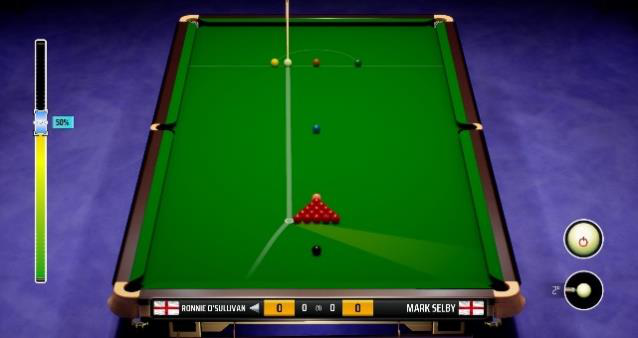
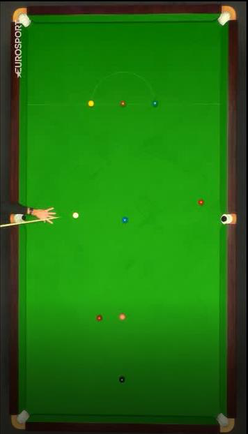
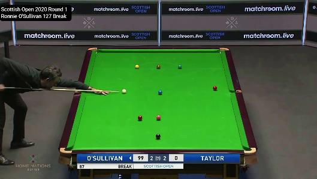
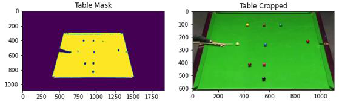
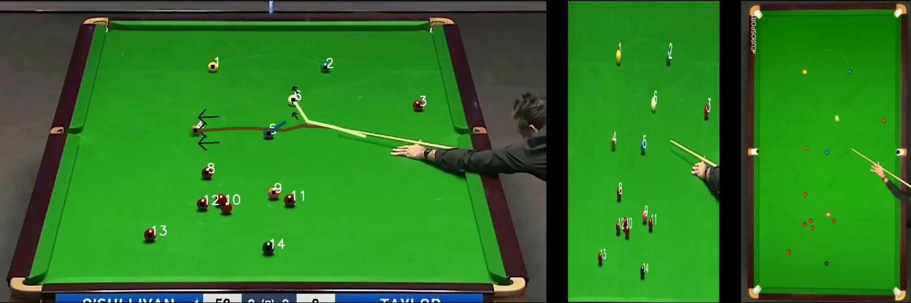
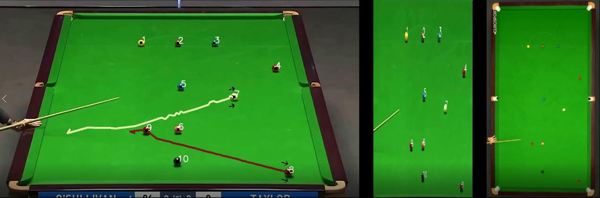
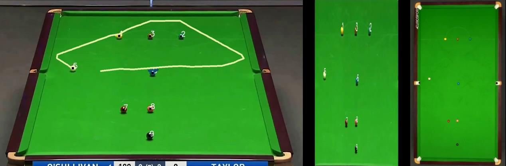

# Final Project - Computer Vision 2020 Winter
## Snooker Table Analyzation
Dan Botchan, Stav Yosef

## Abstract
At the Santiago Bernabeu, the home stadium of Real Madrid football team, there are 32 cameras for broadcasting, and another 38 cameras, in fixed locations surrounding the pitch, for the use of intel's 360 replay technology [1]. During the coronavirus epidemic, the NBA used 30 cameras to broadcast games and to bring the sense of in-game excitement into the viewer's homes.

The vast use of cameras and the well-known characteristics of each pitch creates a natural connection between the world of sports and the capabilities of Computer Vision. In our project, we have chosen to show how a combination of familiar algorithms in computer vision with the characteristics of the snooker table we are able to implement various tools for analyzing and broadcasting the game, based on a video of a gameplay.

## Introduction
Worldwide, sports events are documented by countless cameras and sensors that broadcast and transmit data in a variety of domains such as audio, text, video, etc.

The use of a multitude of cameras, the fixed characteristics, and outlines of the game's field, enable the development of computer vision based algorithms that have a great influence on the way different mediums consume and use the game's data.

The use of ball detection and the ability to understand the pitch and the location of the various players on it, enable real-time projection of statistics of the game, such as player's heatmaps, marking of specific players for identification, and help in making judicial decisions as done nowadays with the VAR in football and soccer.

Thanks to homographic projection algorithms, it is possible to project custom advertisements based on the viewer's location, straight on signs in pitch, during the broadcast of the game.

Another innovation that is nowadays owned by Intel, is a system of cameras that covers the pitch in 360 degrees. This setting of the camera allows modeling, of each timestamp in the broadcast, into a point cloud representation of the game and by that replaying the video from all possible angles.

In this project, we will focus on the game of Snooker. We would like to show how by using old computer vision algorithms and adopting certain assumptions about the position and movement of the camera, we can project the game state into bird eye view angle of the table, and track and analyze the movement of the balls during the video.

## Related Work
Various works have been done on snooker game analysis. S.Mathavan et al [3] positioned a camera over the snooker table. They used thresholds to make each frame binary and used an algorithm called region props to identify the center of mass of each ball. Then, by converting the ball centers into the world coordinates and the knowledge about the timestamp of each frame, they were able to calculate the velocities and trajectory of the ball movement.

Denman et al [4], proposed three different tools: analysis of the geometric shape of the table, Identification of notable events such as shooting the ball into the hole, or player that leans on the table. The last tool they suggested is a summary of the ball movement. They used the assumption that a table is a plane and recognize its border using a threshold of the color of the table, and Hough transform to output the borders of the table. From that point, the detection of the holes is based on prior knowledge of snooker table properties. There are 4 holes in each vertex of the quadrangle and 2 holes in the center of the long edge of the table.

Another example of a work involving snooker table by [5], which they use a top-view camera, to understand the table scene, and then converted it to a 3D model that can be viewed from any angle.

## Data Collection
The first challenge for this project was finding proper data. We needed a video of gameplay, which has a static camera, for which we can make easing assumptions like – that we only have to detect the table's border once. We also wanted to have Bird-Eye-View (BEV) of the same gameplay, to be able to visually evaluate our algorithm.

We suggested 3 ways to get the necessary data.

1. We thought about record our self while playing, using two cameras: one that records from the Bird-Eye-View perspective, and the other one from the side of the table. The problem with this suggestion was to find a place with snooker during the Corona pandemic and also to properly record from bird-eye-view, without the necessary equipment.

2. The idea of using a video game and synthetic data is common in computer vision and has pros and cons. One of the biggest pros is that it enables us to control the properties of the data and the amount. The con when using synthetic data is the question if the same algorithm and parameters will also work when moving to real data. For the limitations of the academic project, we thought using a video game as our data will be sufficient and will allow us to get both regular view and BEV view for each play.
   

4. Our last idea was to try and search for a video of some official game, in the hope we will find a replay of at least one game move, from both angles - regular and BEV. We ended up finding two videos of the same game, being recorded fully, from those two perspectives, so we chose to use this YouTube video as our data.
   

## The Algorithm
The algorithm is based on some assumptions about the data and based on a pipeline of known computer-vision algorithms.

### 1. Assumptions
The first and most crucial assumption is about the camera angle when shooting. Our algorithm is based on the fixed angle of the camera as seen in figure 2 (left).

At this angle, we can see all vertices of the table, and also the camera is high enough, so we get a minimum of balls that hide each other.

The second assumption is about the fixed color of the table. We use prior knowledge about the color of the table to detect the table border.

The third assumption – We made sure that in the videos we use the player almost doesn't hide the table, so all the balls on the table could be detected.

### 2. Detecting the table
We wanted to minimize the area where we are looking for edges, only to the exact area of the table. To do so, we change the first frame of the video from RGB (BGR in cv2) to HSV color space. The hue property of the HSV is less sensitive to light's intensity and therefore, it is easier to use this property to output a mask of all the green components in the frame. Then we used stats about the connected components and search for the component with maximum size to get the exact mask of the table. After we get the mask, we can use the minimum and maximum value of each index in the x-direction and y-direction to find the cropping of the table.

### 3. Identify the border Lines
To find the borderlines, we find each border separately.

Assume we searching for the right border, so we collecting all the points we think are on the right border (we know approximately the center of the table so we searching edges on the right after deleting small components like balls, noises...), then for every 2 points we created a linear line y=mx + c then averaging all the lines to achieving the real line.

### 4. Points of intersection between borderlines
The intersection between borderlines becomes easy after we obtained previously the linear lines of the borders.

### 5. Detection of the balls
Based on the prior knowledge that we should only see balls or part of the player's body in the area of the table - We used canny edge detection on the table's cropped image. Then, we filled all the edges using dilation to reconstruct the ball's shape. After the dilation, we use connected components. We learned what is the range of the sum of pixels, that best represents the size of the balls to identify which components are balls. Their location is based on the center of each component, and their color we know all the possibilities of colors we can "see" on the table so we sampled all the colors found their RGB then for each ball we taking all the pixels around its center and averaging its color then check in customed class we created which color is the closest to the ball by calculating MSE to each of the colors we sampled.

### 6. Ball's tracking
For each ball on the table, we know its color and location so for tracking, we are looking in the previous frame and find which ball is the closest to the current location and have also a match by its color. By knowing for each frame all ball's locations, we can draw optical flow for each of the moving balls.

### 7. BEV projection
The projection to BEV is based on the knowledge that the snooker game is played on a planer surface. This enables the use of Homographic Projection, which is used when we want to project a plane, to a different plane. The advantage of homographic projection is that we only need four matching points to compute the projection matrix. We already computed the vertices of the table's plane in 4.4. So, we can match them with the four vertices of the BEV matrix.

Using those matching points we can compute the projection matrix from the table to BEV and from BEV back to the table. After we found the projection matrix. We can use it to project each pixel from the image plane, into the BEV plane. There is also a hidden assumption here. We know that the ball "lays" on the plane and not a part of the plane. But we also know the center of the ball's bottom has a point of contact with this plane, so the projection around the center of the ball should be valid up to a small error.

## Results
1. Clip 1 - https://youtu.be/p6EngngfAWk

2. Clip 2 - https://youtu.be/mX6_5D3GzrU

3. Clip 3 - https://youtu.be/V50s4olE4_4

## Conclusion & Future work
During the project we experimented with various of famous CV algorithms such as Canny edge detection, Hough transform to detect lines and circles, blub detection, dilation, Homogenous projection etc. Based solely on CV algorithms we managed to get decent tools for game analysis and broadcasting. Tools that can be further improve in future work.

Few examples for possibilities of future work:

1. Use the detection of the ball and the tracking together with computer graphics to reconstruct the game in 3D.
2. Improve the detection of the balls by superposition of results from all the algorithms we tried: Hough Circles, bulb detection and our method.
3. Use CNN networks to detect the ball.
4. Create evaluation method for the BEV by detecting the balls on the ground truth BEV and compare it to the position of the balls in our BEV.

## References
[1] https://scroll.in/field/954938/how-the-el-clasico-broadcast-is-special-in-spanish-football-a-peek-behind-the-scenes

[2] https://www.sportsvideo.org/2020/07/24/nba-returns-league-espn-turner-unveil-preliminary-production-plans-for-the-disney-bubble/

[3] https://www.researchgate.net/publication/228372702_Application_of_high-speed_imaging_to_determine_the_dynamics_of_billiards

[4] https://www.researchgate.net/publication/221368680_Content_Based_Analysis_for_Video_from_Snooker_Broadcasts

[5] https://arrow.tudublin.ie/cgi/viewcontent.cgi?article=1063&context=scschcomcon
